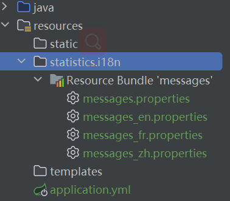
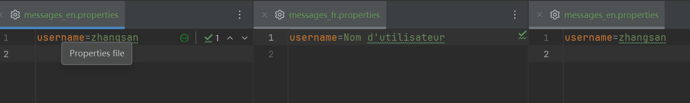
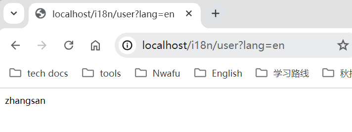
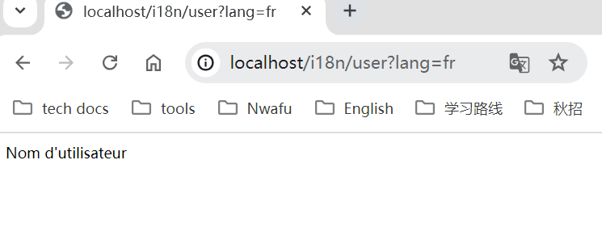
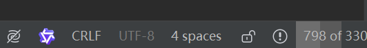

# my-gadget

这个小项目用来记录学习一些 SpringBoot 相关知识

## 国际化

国际化可以通过不同的访问地区得到不同的配置文件，进行适配

### 实现步骤

1. **添加国际化配置文件**

   
   
   
   
   第一个  `messages.properties ` 是默认值


2. **配置国际化文件位置**

	```yml
      spring:
        messages:
          basename: statistics/i18n/messages
          encoding: UTF-8 
	```

3. **添加解析器**

	```java
    @Configuration
    public class LocaleConfig {

	/**
	 * 默认解析器 其中locale表示默认语言
	 */
	  @Bean
	  public LocaleResolver localeResolver() {
		SessionLocaleResolver localeResolver = new SessionLocaleResolver();
		localeResolver.setDefaultLocale(Locale.CHINA);
		return localeResolver;
	  }
    }
    ```

4. **添加拦截器**

   ```java
   @Configuration
   public class WebConfig implements WebMvcConfigurer {
   
   	/**
   	 * 默认拦截器 其中lang表示切换语言的参数名
   	 *
   	 */
   	@Override
   	public void addInterceptors(InterceptorRegistry registry) {
   		LocaleChangeInterceptor localeInterceptor = new LocaleChangeInterceptor();
   		localeInterceptor.setParamName("lang");
   		registry.addInterceptor(localeInterceptor);
   	}
   	
   }
   ```

5. **测试**

   ```java
   
   @RestController
   @RequestMapping("/i18n")
   public class I18nController {
   
   	@RequestMapping("/user")
   	public String getUserName() {
   		return MessageUtils.get("username");
   	}
   }
   
   ```
   
   需要在请求路径后面加上 `lang={}` ，也可以不填进行默认匹配

    

    

    成功访问到不同的 `username` 说明成功实现国际化
6. **遇到的问题**

   出现中文无法访问的情况，一般就是文件的编码出现问题，需要确认国际化的文件是否是 `UTF-8` 的编码
   
   
   
   打开一个 `properties` 文件，确认编码，如果不对的话修改 IDEA 的文件编码 `settings->editor->file-encodings`
